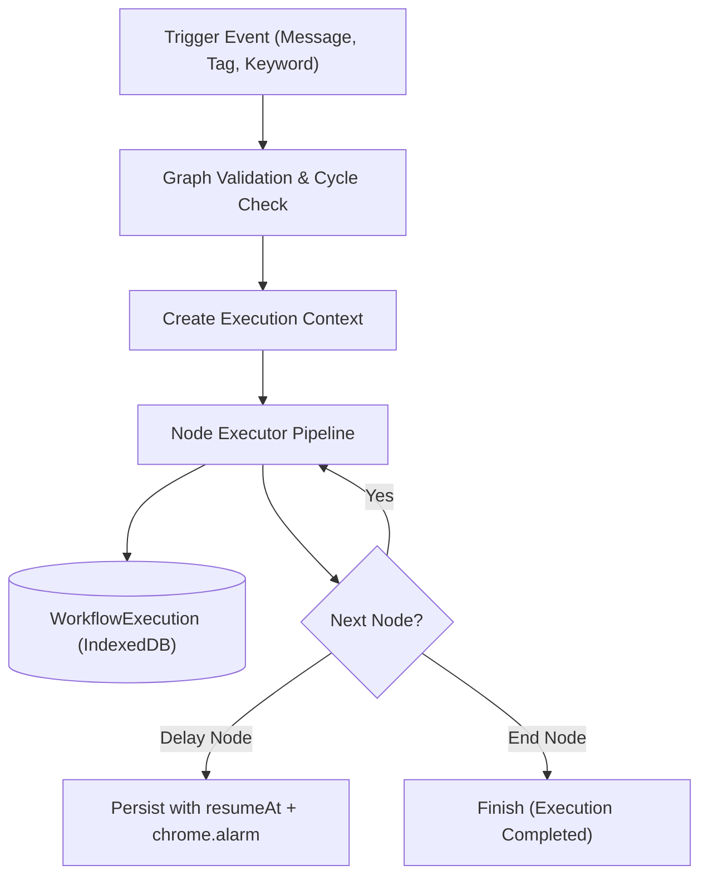

# OpenMsg Workflow Engine Architecture

## 1. Design Overview

The OpenMsg Workflow Engine is an independent, deterministic state machine built to execute multi-step automations and conversational chatbots.

Key Tenet: **No node execution logic is ever placed inside React components**. React Flow is utilized strictly as a visual presentation and node-graph editing canvas.



---

## 2. Node Schema & Contract

Every node in the system implements the strict `WorkflowNodeDefinition` interface:

```ts
export interface WorkflowNodeDefinition<TConfig = Record<string, unknown>> {
  type: string;
  label: string;
  category: 'TRIGGER' | 'MESSAGE' | 'INTERACTIVE' | 'LOGIC' | 'ACTION' | 'FLOW';
  icon: string;
  color: string;
  description: string;

  /** Validates node configuration before saving or running */
  validateConfig(config: unknown): { valid: boolean; errors?: string[] };

  /** Executes the node logic deterministically */
  execute(
    node: WorkflowNode,
    context: WorkflowExecutionContext
  ): Promise<NodeExecutionResult>;
}

export interface NodeExecutionResult {
  status: 'SUCCESS' | 'WAITING_DELAY' | 'WAITING_INPUT' | 'ERROR';
  nextHandle?: string; // outgoing handle (e.g. 'true', 'false', 'default')
  variablesToSet?: Record<string, unknown>;
  resumeAt?: number;
  error?: string;
}
```

---

## 3. Node Catalog

| Node Type | Category | Description | Key Configuration Properties |
| :--- | :--- | :--- | :--- |
| `START` | Trigger | Conversation / workflow starting block | `triggerType`, `keywordFilters`, `allowRestart` |
| `TEXT` | Message | Sends dynamic text with variable replacement | `content`, `typingDelayMs` |
| `IMAGE` | Message | Sends an image attachment | `imageUrl`, `caption` |
| `VIDEO` | Message | Sends a video attachment | `videoUrl`, `caption` |
| `AUDIO` | Message | Sends a voice note / audio track | `audioUrl` |
| `DOCUMENT` | Message | Sends a file attachment (PDF, CSV, etc.) | `documentUrl`, `filename` |
| `BUTTONS` | Interactive | Interactive reply buttons | `buttons: Array<{ id, text }>`, `timeoutMinutes` |
| `LIST` | Interactive | Interactive options list menu | `title`, `buttonText`, `sections` |
| `CONDITION` | Logic | Deterministic branching based on variables | `rules: Array<{ variable, operator, value }>` |
| `DELAY` | Logic | Suspends execution for specified duration | `seconds` (persists state across service worker restarts) |
| `SET_VARIABLE` | Logic | Sets or updates a workflow / contact variable | `variableName`, `expression`, `scope` |
| `TAG_CONTACT` | Action | Applies a CRM tag to the contact | `tagId` |
| `REMOVE_TAG` | Action | Removes a CRM tag from the contact | `tagId` |
| `WEBHOOK` | Action | Dispatches an outbound HTTP webhook | `url`, `method`, `headers`, `payloadTemplate` |
| `HTTP_REQUEST` | Action | Performs an API call and maps JSON output | `url`, `method`, `headers`, `body`, `outputMapping` |
| `START_WORKFLOW` | Flow | Sub-flow invocation | `targetWorkflowId`, `passVariables` |
| `END` | Flow | Terminates execution | `reason`, `archiveChat` |

---

## 4. Manifest V3 Delay & Rehydration Protocol

Because Chrome Manifest V3 service workers terminate when inactive, in-memory `setTimeout` or `sleep()` calls will fail.

OpenMsg solves this with **Durable Execution State**:
1. When a `DELAY` node executes, the engine sets `WorkflowExecution.status = 'WAITING_DELAY'` and calculates `resumeAt = Date.now() + delayMs`.
2. The execution state is saved to IndexedDB (`WorkflowExecutionRepository`).
3. An alarm is registered with Chrome Alarms (`chrome.alarms.create(`openmsg:wf:${executionId}`, { when: resumeAt })`).
4. When `chrome.alarms.onAlarm` fires, the Background Service Worker wakes up, loads the execution state from IndexedDB, and resumes the workflow from the next outgoing node edge.

---

## 5. Security: Safe Expression & Condition Evaluation

> **Strict Security Rule**: OpenMsg **NEVER** uses `eval()`, `new Function()`, or untrusted script interpreters for condition or variable evaluation.

Conditions use a **safe declarative operator engine**:
- Operators: `equals`, `not_equals`, `contains`, `not_contains`, `starts_with`, `ends_with`, `gt`, `gte`, `lt`, `lte`, `is_empty`, `is_not_empty`, `matches_regex` (with ReDoS mitigation).
- Variables are extracted using strict lexical token regexes (`/\{\{([a-zA-Z0-9_]+)\}\}/g`).
